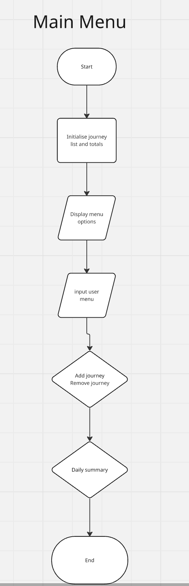
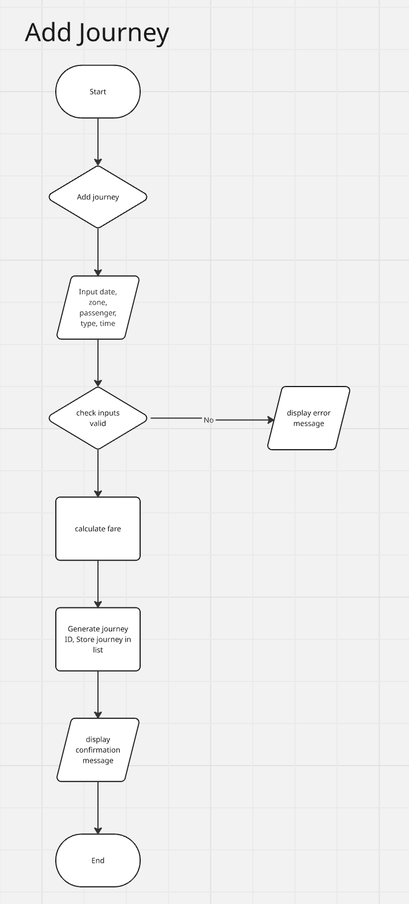
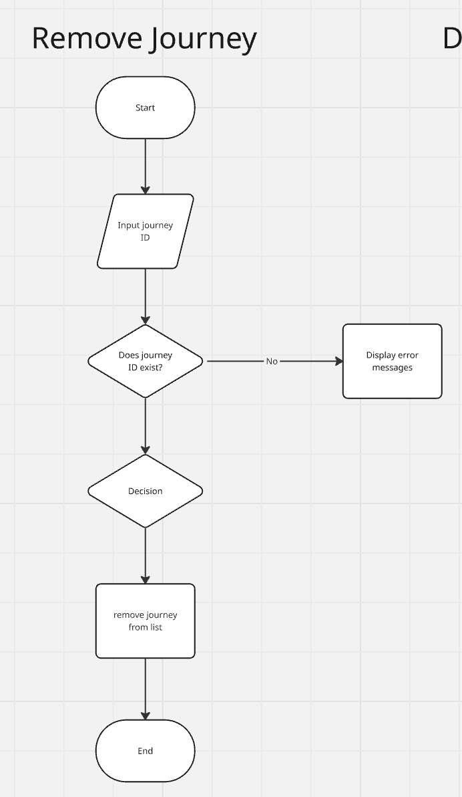
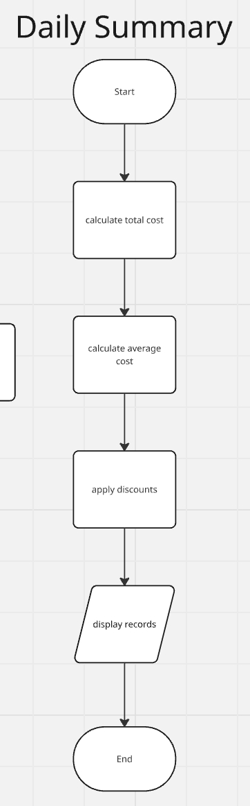
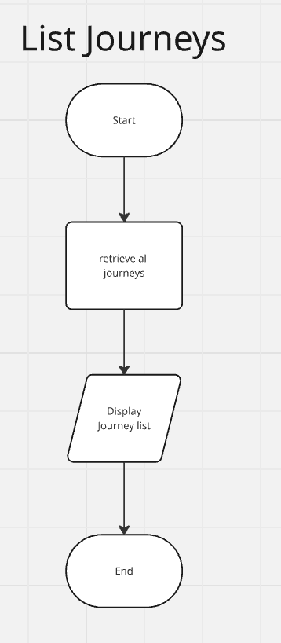
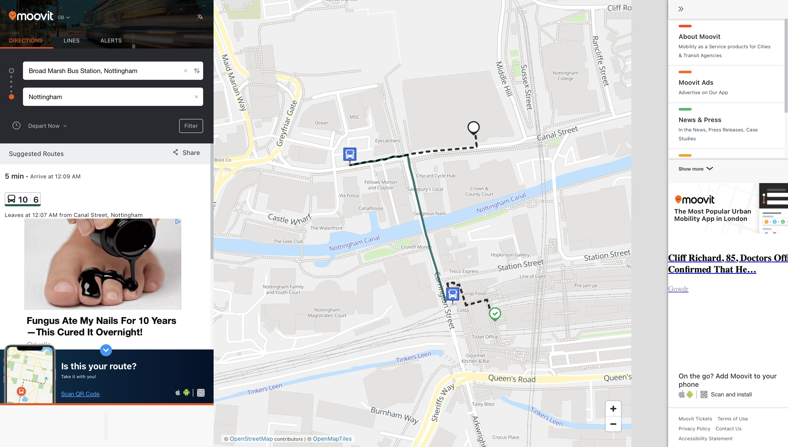
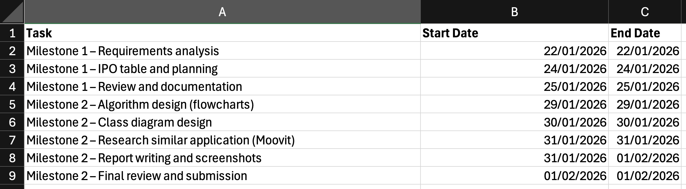

# IY4113 Milestone 2

| Assessment Details | Please Complete All Details                                      |
| ------------------ | ---------------------------------------------------------------- |
| Group              | B                                                                |
| Module Title       | Applied Software Engineering using Object Orientated Programming |
| Assessment Type    | Java Fundatmentals - Practical Part 1                            |
| Module Tutor Name  | Jonathan Shore                                                   |
| Student ID Number  | P0460817                                                         |
| Date of Submission | 01/02/2026                                                       |
| Word Count         | 1200                                                             |

- [x] *I confirm that this assignment is my own work. Where I have referred to academic sources, I have provided in-text citations and included the sources in
  the final reference list.*

- [x] *Where I have used AI, I have cited and referenced appropriately.

------------------------------------------------------------------------------------------------------------------------------

### Algorithm Design

------------------------------------------------------------------------------------------------------------------------------

The algorithm design for the CityRide Lite program is explained using flowcharts and a class diagram.

The program is split into different sections such as Main Menu, Add Journey, Remove Journey, Daily Summary and List Journeys.

These flowcharts show how user input is handled and what actions the program takes.

- 

- 

- 

- 

- 

- 

- 

- 

- 

------------------------------------------------------------------------------------------------------------------------------

### Research

------------------------------------------------------------------------------------------------------------------------------

*Research existing programs that solve a similar problem. The program does not have to be written in java or object orientated in nature - just solve a similar type of problem.* 

*Use the strucutre below to capture your evidence:*

------------------------------------------------------------------------------------------------------------------------------Name of program: Moovit

Reference (link): https://moovitapp.com/

What it does well :What it does well:

- Provides real-time public transport journey planning.
- Allows users to view routes based on current location.
- Supports multiple transport types.

What it does poorly :

- Does not calculate journey fare costs.

- Does not offer daily summary information.

Key design ideas you could reuse (e.g., layout, navigation, input/output, program structure):

- Real-time journey listing for user input/output.

Screenshot (showing the interface/outp

------------------------------------------------------------------------------------------------------------------------------

### Updated Gantt Chart

------------------------------------------------------------------------------------------------------------------------------

------------------------------------------------------------------------------------------------------------------------------

### Diary Entries

------------------------------------------------------------------------------------------------------------------------------

### 29/01/2026 – Diary Entry 4

I started working on the algorithm design for the CityRide Lite program. I created flowcharts for the main features such as Main Menu, Add Journey, Remove Journey, Daily Summary and List Journeys. This helped me understand how the program should work step by step and how user input is processed.

### 30/01/2026 – Diary Entry 5

I designed the class diagram for the program. I identified the main classes such as Journey, Journey Manager, Fare Calculator and Daily Summary. I added attributes and methods to each class to show how the system is structured. This made the object-oriented design of the program clearer.

### 31/01/2026 – Diary Entry 6

I researched an existing transport application (Moovit) that solves a similar problem. I analysed what the program does well and what it does poorly. I also identified design ideas that could be reused in my own program, such as clear navigation and simple input and output design. I updated the Gantt chart and added all diagrams and screenshots to the report.

------------------------------------------------------------------------------------------------------------------------------
