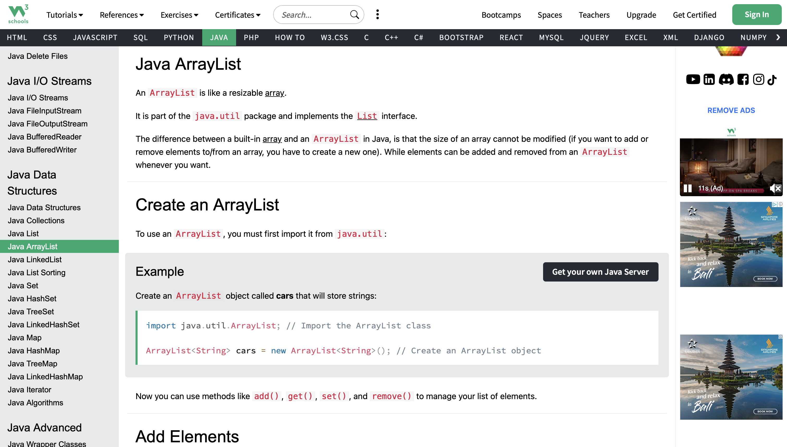
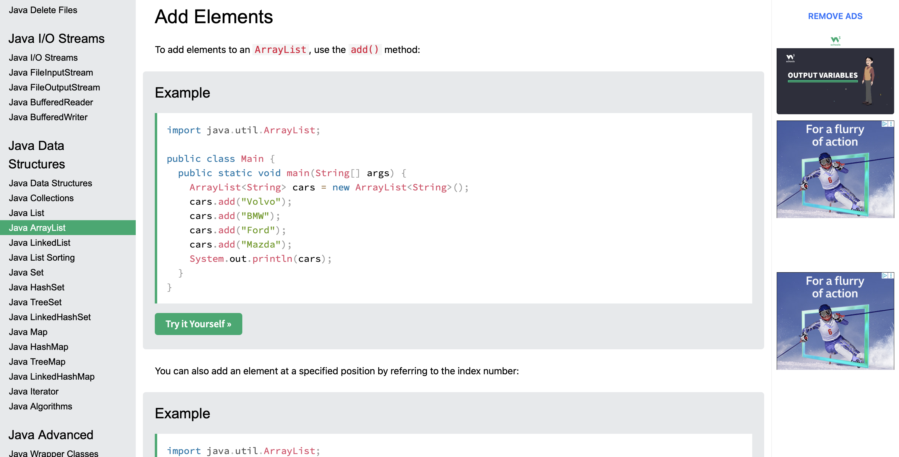
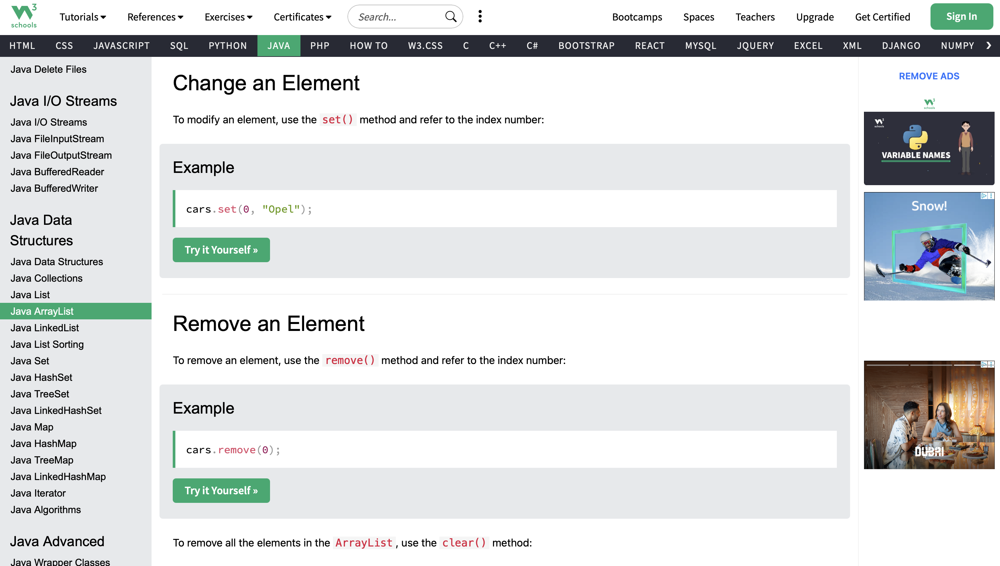
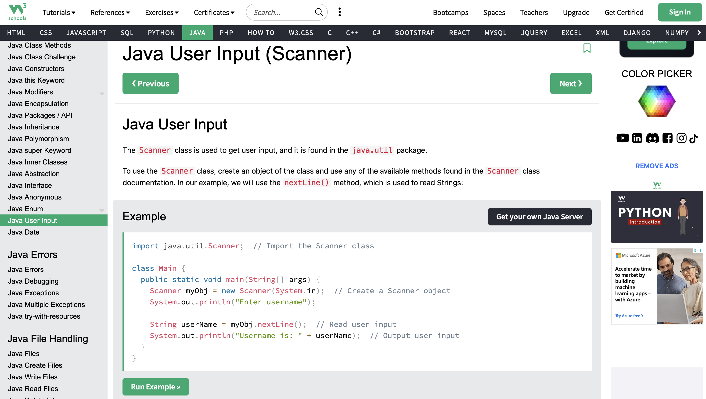
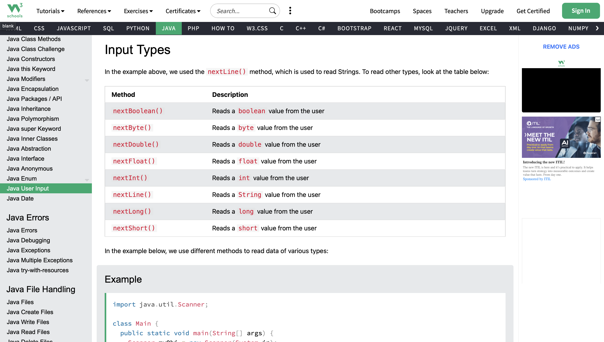
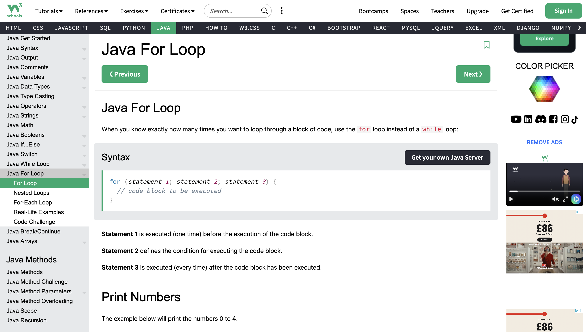
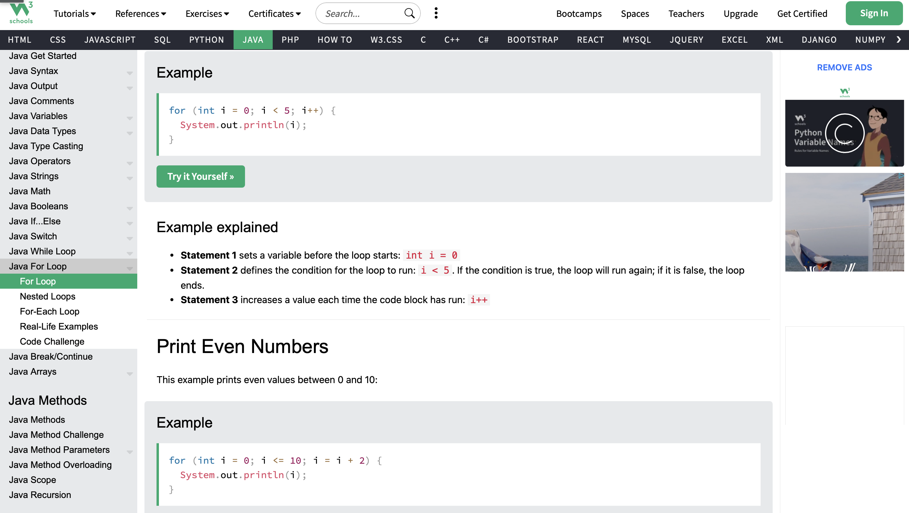
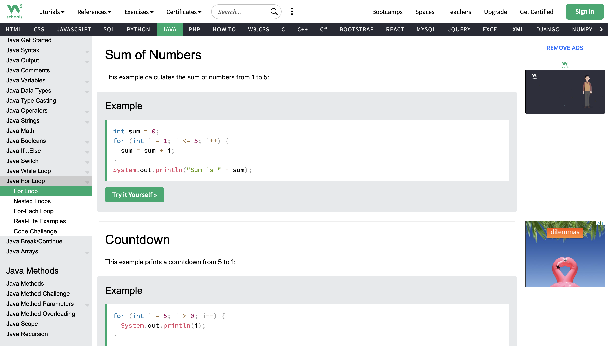
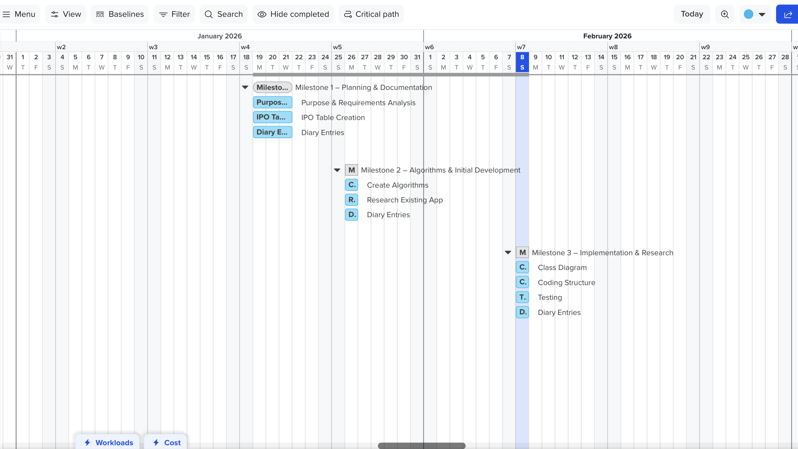

# IY4113 Milestone 3

| Assessment Details | Please Complete All Details                                    |
| ------------------ | -------------------------------------------------------------- |
| Group              | B                                                              |
| Module Title       | Applied Software Engineering using Object Oriented Programming |
| Assessment Type    | Practical assignment part 1: Java Fundamentals                 |
| Module Tutor Name  | Jonathan Shore                                                 |
| Student ID Number  | P0460817                                                       |
| Date of Submission | 08/02/2026                                                     |
| Word Count         | 1200                                                           |

- [x] *I confirm that this assignment is my own work. Where I have referred to academic sources, I have provided in-text citations and included the sources in
  the final reference list.*

- [x] *Where I have used AI, I have cited and referenced appropriately.

------------------------------------------------------------------------------------------------------------------------------

### Research

---

**Title of research: Using ArrayList in Java for Dynamic Object Storage**

****Reference (link):** [Java ArrayList](https://www.w3schools.com/java/java_arraylist.asp)

How does the research help with coding practise?: 

This research showed how Journey objects can be stored inside a dynamic list during a single program session. I learned how to add, remove and iterate through elements using loops. This aligns with the requirement that journeys must be stored in memory (in-session only) and supports listing, searching and deleting journeys.

Key coding ideas you could reuse in your program:

- Creating an ArrayList<Journey>

- Using add() and remove() methods  

- Iterating using a for-each loop  

- Using index-based loops for safe removal
  
  ---

Screenshot of research:







------------------------------------------------------------------------------------------------------------------------------

### Title of research: Using Scanner for User Input in Java

**Reference (link):** [Java User Input (Scanner class)](https://www.w3schools.com/java/java_user_input.asp)

How does the research help with coding practise?:

This research supported the implementation of a menu-driven console program. It showed how to capture user input using the Scanner class and how to read different data types such as String and int. It also helped me understand the common newline/buffer issue when mixing nextInt() and nextLine(), which I handled by using nextLine()after numeric input.

Key coding ideas you could reuse in your program:

- Importing and creating a Scanner object  

- Capturing menu choices using integers  

- Capturing text input using nextLine()  

- Clearing the buffer after numeric input
  
  ---

Screenshot of research:

  


---

### Title of research: Using For Loop in Java

**Reference (link):** [Java For Loop](https://www.w3schools.com/java/java_for_loop.asp)

**How does the research help with coding practise?**  
This research explained how a `for` loop can repeat actions a specific number of times. It helped me apply iteration in my program when scanning through journeys to find a matching ID for removal, and when calculating totals and counts for summaries.

**Key coding ideas you could reuse in your program:**  

- Using index-based loops  
- Checking conditions inside loops  
- Iterating through multiple objects and displaying results

Screenshot of research:

  
  


------------------------------------------------------------------------------------------------------------------------------

### Program Code

------------------------------------------------------------------------------------------------------------------------------

*Program code goes here:*

# IY4113 Milestone 3

| Assessment Details | Please Complete All Details                                    |
| ------------------ | -------------------------------------------------------------- |
| Group              | B                                                              |
| Module Title       | Applied Software Engineering using Object Oriented Programming |
| Assessment Type    | Practical assignment part 1: Java Fundamentals                 |
| Module Tutor Name  | Jonathan Shore                                                 |
| Student ID Number  | P0460817                                                       |
| Date of Submission | 08/02/2026                                                     |
| Word Count         | 1200                                                           |

- [x] *I confirm that this assignment is my own work. Where I have referred to academic sources, I have provided in-text citations and included the sources in the final reference list.*
- [x] *Where I have used AI, I have cited and referenced appropriately.*

---

## Research

### Title of research: Using ArrayList in Java for Dynamic Object Storage

**Reference (link):** [Java ArrayList](https://www.w3schools.com/java/java_arraylist.asp)

**How does the research help with coding practise?**  
This research showed how `Journey` objects can be stored inside a dynamic list during a single program session. I learned how to add, remove and iterate through elements using loops. This aligns with the requirement that journeys must be stored in memory (in-session only) and supports listing, searching and deleting journeys.

**Key coding ideas you could reuse in your program:**  

- Creating an `ArrayList<Journey>`  
- Using `add()` and `remove()` methods  
- Iterating using a for-each loop  
- Using index-based loops for safe removal

**Screenshot of research:**  
  
  


---

### Title of research: Using Scanner for User Input in Java

**Reference (link):** [Java User Input (Scanner class)](https://www.w3schools.com/java/java_user_input.asp)

**How does the research help with coding practise?**  
This research supported the implementation of a menu-driven console program. It showed how to capture user input using the `Scanner` class and how to read different data types such as `String` and `int`. It also helped me understand the common newline/buffer issue when mixing `nextInt()` and `nextLine()`, which I handled by using `nextLine()` after numeric input.

**Key coding ideas you could reuse in your program:**  

- Importing and creating a `Scanner` object  
- Capturing menu choices using integers  
- Capturing text input using `nextLine()`  
- Clearing the buffer after numeric input

**Screenshot of research:**  
  


---

### Title of research: Using For Loop in Java

**Reference (link):** [Java For Loop](https://www.w3schools.com/java/java_for_loop.asp)

**How does the research help with coding practise?**  
This research explained how a `for` loop can repeat actions a specific number of times. It helped me apply iteration in my program when scanning through journeys to find a matching ID for removal, and when calculating totals and counts for summaries.

**Key coding ideas you could reuse in your program:**  

- Using index-based loops: `for (int i = 0; i < list.size(); i++)`  
- Checking conditions inside loops  
- Iterating through multiple objects and displaying results

**Screenshot of research:**  
  
  


---

## Program Code

```java
import java.util.ArrayList;
import java.util.List;
import java.util.Scanner;

class Journey {
    private int journeyID;
    private String date;
    private int zone;
    private String passengerType;
    private String timeBand;
    private double fare;

    public Journey(int journeyID, String date, int zone, String passengerType, String timeBand) {
        this.journeyID = journeyID;
        this.date = date;
        this.zone = zone;
        this.passengerType = passengerType;
        this.timeBand = timeBand;
        this.fare = 0;
    }

    public int getJourneyID() { return journeyID; }
    public String getDate() { return date; }
    public int getZone() { return zone; }
    public String getPassengerType() { return passengerType; }
    public String getTimeBand() { return timeBand; }
    public double getFare() { return fare; }

    public void setFare(double fare) { this.fare = fare; }

    public void displayDetails() {
        System.out.println("[" + journeyID + "] Date: " + date
                + " | Zone: " + zone
                + " | Passenger: " + passengerType
                + " | Time: " + timeBand
                + " | Fare: £" + String.format("%.2f", fare));
    }
}

class FareCalculator {
    public double calculateFare(int zone, String passengerType, String timeBand) {
        double base = getBaseFareByZone(zone);

        if (timeBand.equalsIgnoreCase("Peak")) {
            base = base + 0.50;
        }

        return applyDiscount(base, passengerType);
    }

    private double getBaseFareByZone(int zone) {
        if (zone == 1) return 2.50;
        if (zone == 2) return 3.20;
        if (zone == 3) return 4.00;
        return 3.20;
    }

    private double applyDiscount(double fare, String passengerType) {
        if (passengerType.equalsIgnoreCase("Child")) {
            return fare * 0.50;
        } else if (passengerType.equalsIgnoreCase("Student")) {
            return fare * 0.80;
        } else if (passengerType.equalsIgnoreCase("Senior")) {
            return fare * 0.70;
        }
        return fare;
    }

    public double applyDailyCap(double totalCost, int zone) {
        double cap = getCapByZone(zone);
        return Math.min(totalCost, cap);
    }

    private double getCapByZone(int zone) {
        if (zone == 1) return 7.00;
        if (zone == 2) return 8.50;
        if (zone == 3) return 10.00;
        return 8.50;
    }
}

class DailySummary {
    private String date;
    private double totalCost;
    private double averageCost;
    private int totalJourneys;

    public DailySummary(String date, double totalCost, double averageCost, int totalJourneys) {
        this.date = date;
        this.totalCost = totalCost;
        this.averageCost = averageCost;
        this.totalJourneys = totalJourneys;
    }

    public void displaySummary() {
        System.out.println("\nDaily Summary for " + date);
        System.out.println("Total journeys: " + totalJourneys);
        System.out.println("Total cost: £" + String.format("%.2f", totalCost));
        System.out.println("Average cost: £" + String.format("%.2f", averageCost));
    }
}

class JourneyManager {
    private List<Journey> journeys = new ArrayList<>();
    private FareCalculator fareCalculator = new FareCalculator();
    private int nextJourneyID = 1;

    public void addJourney(String date, int zone, String passengerType, String timeBand) {
        Journey j = new Journey(nextJourneyID, date, zone, passengerType, timeBand);
        double fare = fareCalculator.calculateFare(zone, passengerType, timeBand);
        j.setFare(fare);

        journeys.add(j);
        System.out.println("Journey added successfully. Journey ID: " + nextJourneyID);
        nextJourneyID++;
    }

    public boolean removeJourney(int journeyID) {
        for (int i = 0; i < journeys.size(); i++) {
            if (journeys.get(i).getJourneyID() == journeyID) {
                journeys.remove(i);
                System.out.println("Journey removed successfully.");
                return true;
            }
        }
        System.out.println("Journey ID not found.");
        return false;
    }

    public void listJourneys() {
        if (journeys.isEmpty()) {
            System.out.println("No journeys recorded.");
            return;
        }
        System.out.println("\nAll Journeys:");
        for (Journey j : journeys) {
            j.displayDetails();
        }
    }

    public void getDailySummary(String date) {
        double total = 0;
        int count = 0;

        int maxZoneForThatDay = 1;

        for (Journey j : journeys) {
            if (j.getDate().equalsIgnoreCase(date)) {
                total += j.getFare();
                count++;
                if (j.getZone() > maxZoneForThatDay) {
                    maxZoneForThatDay = j.getZone();
                }
            }
        }

        if (count == 0) {
            System.out.println("No journeys found for that date.");
            return;
        }

        total = fareCalculator.applyDailyCap(total, maxZoneForThatDay);
        double avg = total / count;

        DailySummary ds = new DailySummary(date, total, avg, count);
        ds.displaySummary();
    }
}

public class CityRideLiteApp {
    public static void main(String[] args) {
        Scanner sc = new Scanner(System.in);
        JourneyManager manager = new JourneyManager();
        int choice;

        do {
            System.out.println("\nCityRide Lite");
            System.out.println("1. Add Journey");
            System.out.println("2. Remove Journey");
            System.out.println("3. Daily Summary");
            System.out.println("4. List Journeys");
            System.out.println("5. Exit");
            System.out.print("Choice: ");

            choice = sc.nextInt();
            sc.nextLine();

            switch (choice) {
                case 1:
                    System.out.print("Enter date (e.g. 01/02/2026): ");
                    String date = sc.nextLine();

                    System.out.print("Enter zone (1-3): ");
                    int zone = sc.nextInt();
                    sc.nextLine();

                    System.out.print("Enter passenger type (Adult, Child, Student, Senior): ");
                    String passengerType = sc.nextLine();

                    System.out.print("Enter time band (Peak/OffPeak): ");
                    String timeBand = sc.nextLine();

                    manager.addJourney(date, zone, passengerType, timeBand);
                    break;

                case 2:
                    System.out.print("Enter Journey ID to remove: ");
                    int id = sc.nextInt();
                    sc.nextLine();
                    manager.removeJourney(id);
                    break;

                case 3:
                    System.out.print("Enter date for summary (e.g. 01/02/2026): ");
                    String summaryDate = sc.nextLine();
                    manager.getDailySummary(summaryDate);
                    break;

                case 4:
                    manager.listJourneys();
                    break;

                case 5:
                    System.out.println("Exiting...");
                    break;

                default:
                    System.out.println("Invalid choice!");
            }

        } while (choice != 5);

        sc.close();
    }
}
```

------------------------------------------------------------------------------------------------------------------------------

### Updated Gantt Chart

------------------------------------------------------------------------------------------------------------------------------

  

------------------------------------------------------------------------------------------------------------------------------

### Diary Entries

------------------------------------------------------------------------------------------------------------------------------

### 08/02/2026 – Diary Entry 7 – Implementing Core Functionality and Refining Structure

---

In this stage, I reviewed the overall structure of my application with a strong focus on object-oriented design principles. I intentionally separated responsibilities across different classes to improve clarity and maintainability. The Journey class represents a single journey entity and stores journey-related data. The FareCalculator class is responsible only for fare calculation logic. The JourneyManager class handles storage, addition, removal and retrieval of journeys. The DailySummary class focuses exclusively on reporting and summarising data.

This separation ensures that each class has a clearly defined purpose and follows the Single Responsibility Principle (SRP). By applying this principle, I reduced coupling between components and made the system easier to modify and extend. For example, if fare rules change in the future such as implementing multi-zone calculations or more complex discount policies modifications can be made inside the FareCalculator class without affecting the rest of the system.

One design decision I made was to store journeys using an ArrayList. This allows dynamic storage during runtime without requiring fixed-size arrays. Since the specification states that data only needs to exist during a single session, in-memory storage is appropriate at this stage.

I deliberately implemented a simplified fare calculation model first to validate the overall structure before integrating the full dataset logic required in the specification. This incremental approach helped me test core functionality early and reduce debugging complexity.

At this stage, the program successfully supports:

- Adding journeys

- Storing journeys in memory

- Removing journeys

- Listing journeys

- Generating a daily summary

However, further improvements are planned, including stronger input validation, improved error handling and expanding the fare logic to better reflect the full specification dataset.

------------------------------------------------------------------------------------------------------------------------------
