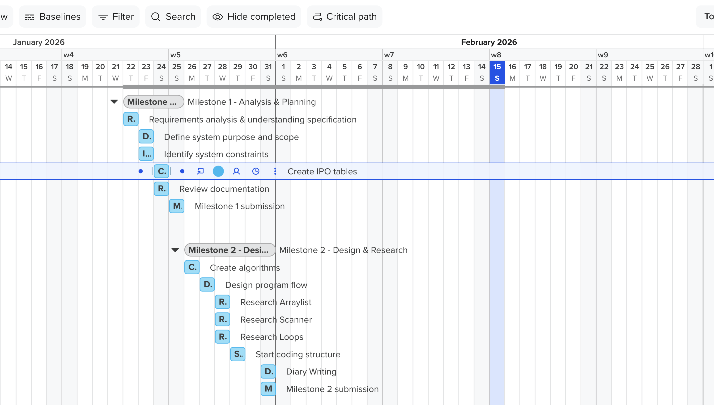
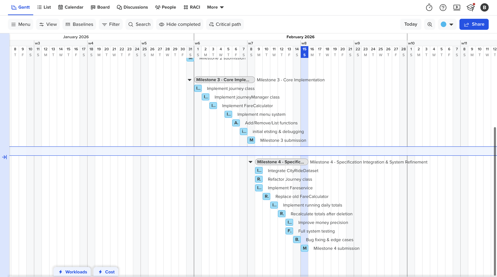

# IY4113 Milestone 4

| Assessment Details | Please Complete All Details                                   |
| ------------------ | ------------------------------------------------------------- |
| Group              | B                                                             |
| Module Title       | Applied Sofware Engineering using Object Oriented Programming |
| Assessment Type    | Java Fundamentals                                             |
| Module Tutor Name  | Jonathan Shore                                                |
| Student ID Number  | P460817                                                       |
| Date of Submission | 15/02/2026                                                    |
| Word Count         | 1200                                                          |
| GItHub Link        | https://github.com/BatuhanSert777/IY4113-Milestone            |

- [x] *I confirm that this assignment is my own work. Where I have referred to academic sources, I have provided in-text citations and included the sources in
  the final reference list.*

- [x] *Where I have used AI, I have cited and referenced appropriately.

------------------------------------------------------------------------------------------------------------------------------

### Program Code

---

import java.math.BigDecimal;
import java.math.RoundingMode;
import java.util.*;

class Journey {
    int id;
    String date;
    int fromZone, toZone;
    CityRideDataset.TimeBand band;
    CityRideDataset.PassengerType type;

    int zonesCrossed;
    BigDecimal baseFare, discountedFare, chargedFare;

Journey(int id, String date, int fromZone, int toZone,
            CityRideDataset.TimeBand band, CityRideDataset.PassengerType type) {
        this.id = id;
        this.date = date;
        this.fromZone = fromZone;
        this.toZone = toZone;
        this.band = band;
        this.type = type;
        this.zonesCrossed = Math.abs(toZone - fromZone) + 1;

    }

}

class FareService {

    BigDecimal calculateBaseFare(Journey j) {

return CityRideDataset.getBaseFare(j.fromZone, j.toZone, j.band);
    }

    BigDecimal applyDiscount(BigDecimal baseFare, CityRideDataset.PassengerType type) {
        BigDecimal rate = CityRideDataset.DISCOUNT_RATE.get(type);

return money(baseFare.multiply(BigDecimal.ONE.subtract(rate)));
    }

    BigDecimal applyCap(BigDecimal discountedFare,
                        BigDecimal currentRunningTotal,
                        CityRideDataset.PassengerType type) {
        BigDecimal cap = CityRideDataset.DAILY_CAP.get(type);

BigDecimal remaining = cap.subtract(currentRunningTotal);

        if (remaining.compareTo(BigDecimal.ZERO) <= 0) return money(BigDecimal.ZERO);
        return money(discountedFare.min(remaining));
    }
    
    BigDecimal money(BigDecimal v) {
        return v.setScale(2, RoundingMode.HALF_UP);
    }

}

class JourneyManager {
    private final List<Journey> journeys = new ArrayList<>();
    private final FareService fare = new FareService();
    private int nextId = 1;
private final EnumMap<CityRideDataset.PassengerType, BigDecimal> runningTotals =
            new EnumMap<>(CityRideDataset.PassengerType.class);

    JourneyManager() {
        for (CityRideDataset.PassengerType t : CityRideDataset.PassengerType.values()) {
            runningTotals.put(t, BigDecimal.ZERO.setScale(2, RoundingMode.HALF_UP));
        }
    }
    
    void addJourney(String date, int fromZone, int toZone,
                    CityRideDataset.TimeBand band, CityRideDataset.PassengerType type) {
    
        Journey j = new Journey(nextId++, date, fromZone, toZone, band, type);
    
        j.baseFare = fare.calculateBaseFare(j);
        j.discountedFare = fare.applyDiscount(j.baseFare, j.type);
    
        BigDecimal current = runningTotals.get(type);
        j.chargedFare = fare.applyCap(j.discountedFare, current, type);
        runningTotals.put(type, fare.money(current.add(j.chargedFare)));
    
        journeys.add(j)

boolean removeJourney(int id) {
        boolean removed = journeys.removeIf(j -> j.id == id);
        if (removed) recalcAllChargedTotals();
        return removed;
void recalcAllChargedTotals() {
        for (CityRideDataset.PassengerType t : runningTotals.keySet()) {
            runningTotals.put(t, BigDecimal.ZERO.setScale(2, RoundingMode.HALF_UP));
        }
        for (Journey j : journeys) {
            BigDecimal current = runningTotals.get(j.type);
            j.chargedFare = fare.applyCap(j.discountedFare, current, j.type);
            runningTotals.put(j.type, fare.money(current.add(j.chargedFare)));
        }
    }

void listJourneys() {
        for (Journey j : journeys) {
            System.out.printf("[%d] %s %d->%d %s %s zones=%d base=£%s disc=£%s charged=£%s%n",
                    j.id, j.date, j.fromZone, j.toZone, j.band, j.type, j.zonesCrossed,
                    j.baseFare, j.discountedFare, j.chargedFare);
        }
    }
}
class AppSnippet {
    public static void main(String[] args) {
        JourneyManager jm = new JourneyManager();
        jm.addJourney("15/02/2026", 1, 4, CityRideDataset.TimeBand.PEAK, CityRideDataset.PassengerType.STUDENT);
        jm.addJourney("15/02/2026", 1, 4, CityRideDataset.TimeBand.PEAK, CityRideDataset.PassengerType.STUDENT);
        jm.listJourneys();
        jm.removeJourney(1);
jm.listJourneys();
    }
}

------------------------------------------------------------------------------------------------------------------------------

### Updated Gantt Chart

------------------------------------------------------------------------------------------------------------------------------

------------------------------------------------------------------------------------------------------------------------------

### Diary Entries

------------------------------------------------------------------------------------------------------------------------------

##### 15/02/2026 — Diary Entry — Specification Integration & System Validation

The system evolved into a working, compliant transport fare system. The implementation initially used hard-coded fares, which allowed functionality testing but did not reflect real transport pricing. After integrating the iCityRide dataset, fare calculation became state-dependent, as each journey cost depends on multiple factors, including travel zones, time bands, passenger discounts, and the daily cap.

This stage focused on correctness, maintainability, and adherence to the specification rather than adding new features, moving the system closer to real-world software behaviour.

------------------------------------------------------------------------------------------------------------------------------
