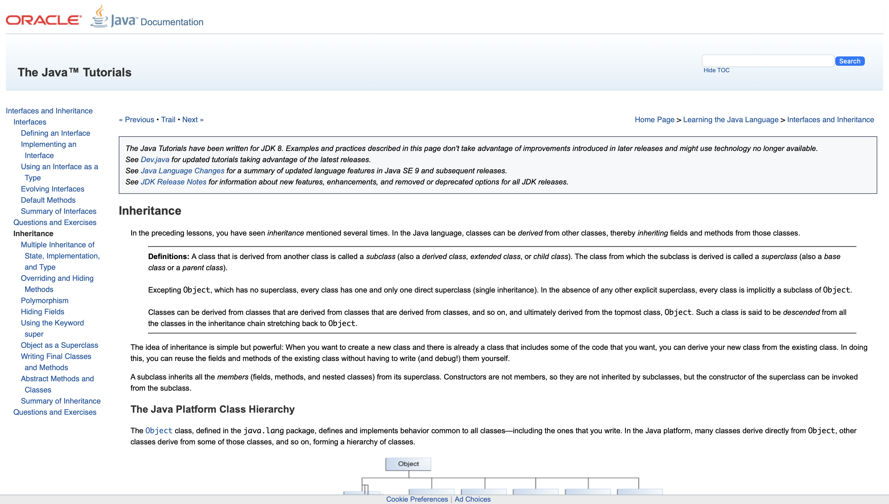
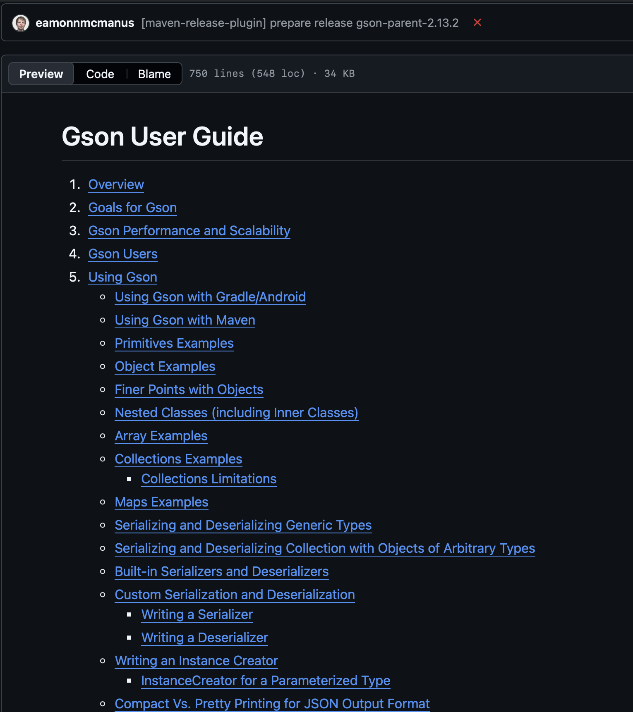
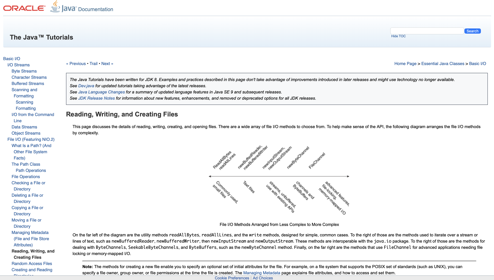
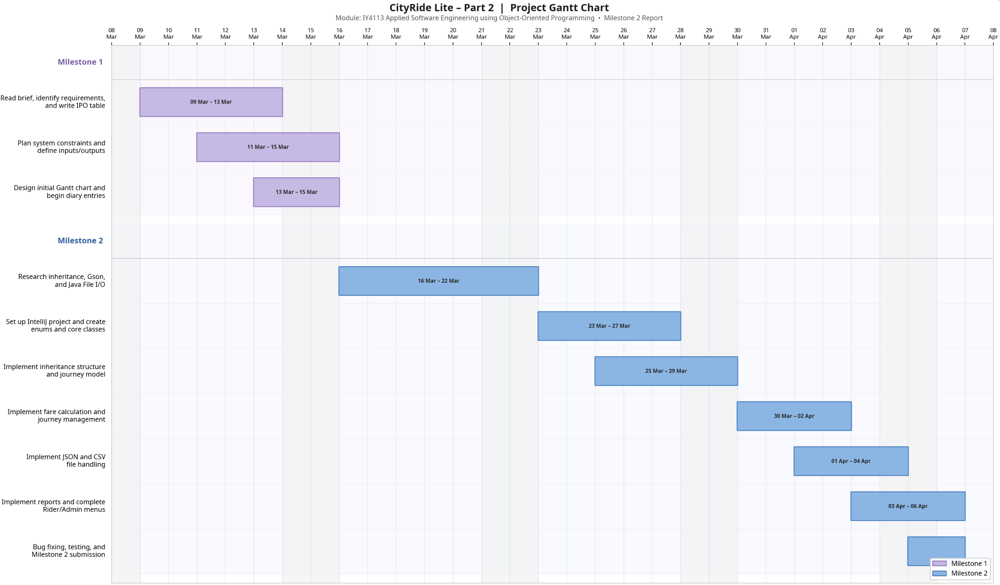

# IY4113 Part 2 – Milestone 2

| Assessment Details | Details |

|---|---|

| Group | B |

| Module Title | Applied Software Engineering using Object-Oriented Programming |

| Assessment Type | Java programming with inheritance and file handling |

| Module Tutor Name | Jonathan Shore |

| Student ID Number | P0460817 |

| Date of Submission | 06/04/2026 |

| Word Count | ~1900 |

| GitHub Link | [GitHub - BatuhanSert777/IY4113-Milestone: IY4113 – CityRide Lite planning and documentation. · GitHub](https://github.com/BatuhanSert777/IY4113-Milestone) |

- [x] *I confirm that this assignment is my own work. Where I have referred to academic sources, I have provided in-text citations and included the sources in the final reference list.*

- [x] *Where I have used AI, I have cited and referenced appropriately.*

---

## Research

---

### Research 1 – Java Inheritance and Abstract Classes

**Title of research:** Java Inheritance — Subclasses and Superclasses

**Reference:** Oracle (2024a) *Inheritance (The Java™ Tutorials)*. Available at: https://docs.oracle.com/javase/tutorial/java/IandI/subclasses.html [Accessed 4 April 2026]

**How does the research help with coding practice?**

The assignment brief requires the program to support two roles: Rider and Admin. Both users share some things in common (for example, both have a name), but they behave differently in the program. I needed to understand how to use a parent class to hold the shared parts, and let subclasses handle what is different. The Oracle tutorial explained this clearly — in Java, you use `extends` to create a subclass, and `abstract` on a method to force every subclass to provide its own version.

One specific thing I learned is the difference between a regular method and an abstract method. A regular method has code inside it. An abstract method has no code — it just says "every subclass must implement this". This was important for `getRole()`, because I needed `Rider` to return `"Rider"` and `Admin` to return `"Admin"`, but I did not want to write that logic in the parent class.

**Key coding ideas I reused in my program:**

- Using an abstract base class (`User`)

- Defining shared fields (e.g. name)

- Using `abstract` methods to enforce subclass behaviour

- Using `@Override` to implement methods correctly

```java
// User.java — abstract base class

public abstract class User {

private String name;


public User(String name) {

this.name = name;

}


public String getName() { return name; }

public void setName(String name) { this.name = name; }


// Every subclass must say what role they are

public abstract String getRole();

}
```

```java
// Rider.java — extends User

public class Rider extends User {

@Override

public String getRole() {

return "Rider";

}

}


// Admin.java — extends User

public class Admin extends User {

@Override

public String getRole() {

return "Admin";

}

}
```

The `@Override` annotation tells the compiler that this method is intentionally replacing the abstract one from the parent. If I accidentally mistyped the method name, the compiler would catch it — which is useful for avoiding silent bugs.

**Screenshot:



---

### Research 2 – Gson: Saving and Loading Java Objects as JSON

**Title of research:** Gson User Guide — Serialisation and Deserialisation

**Reference:** Google (2024) *Gson User Guide*. GitHub. Available at: https://github.com/google/gson/blob/main/UserGuide.md [Accessed 4 April 2026]

**How does the research help with coding practice?**

The brief says rider profiles and system configuration must be saved and loaded using JSON (FR4, FR5, FR14). I had used Gson in a practice project before, but I needed to look at the documentation again because this time the objects I was saving were more complex — they included `HashMap` fields and enum values, which I had not tried before.

The Gson User Guide showed that the basic pattern is:

- `gson.toJson(object, writer)` to save an object as JSON

- `gson.fromJson(reader, ClassName.class)` to load it back

It also showed how to use `GsonBuilder().setPrettyPrinting().create()` to make the JSON output nicely formatted and readable.

**Key coding ideas I reused in my program:**

In `ConfigManager.java`, I used the standard Gson pattern to save and load the `AppConfig` object. The `try-catch` block handles the case where the file does not exist yet — which is expected on first run:

```java
// ConfigManager.java — loading config

public AppConfig loadConfig() {

try {

FileReader reader = new FileReader(CONFIG_FILE_PATH);

AppConfig config = gson.fromJson(reader, AppConfig.class);

reader.close();

if (config == null) {

return createDefaultConfig();

}

return config;

} catch (IOException e) {

// File not found on first run — use defaults instead of crashing

System.out.println("No config file found. Using default settings.");

return createDefaultConfig();

}

}
```

For `ProfileManager.java`, I ran into a specific problem: Gson does not always handle Java enums cleanly when they have constructor parameters. To avoid this, I created a small private helper class (`ProfileData`) that stores the enum values as plain strings, then converts them back when loading:

```java
// Saving — convert enums to strings first

ProfileData data = new ProfileData();

data.name = rider.getName();

data.passengerType = rider.getPassengerType().name();

data.defaultPayment = rider.getDefaultPayment().name();

gson.toJson(data, writer);


// Loading — convert strings back to enums

PassengerType type = PassengerType.valueOf(data.passengerType);

PaymentOption payment = PaymentOption.valueOf(data.defaultPayment);

return new Rider(data.name, type, payment);
```

This approach is safe and explicit — if someone edits the JSON file and types an invalid value, the `valueOf()` call throws an `IllegalArgumentException`, which I catch and handle with an error message.

**Screenshot:** 



---

### Research 3 – Java File I/O: Reading and Writing Text Files

**Title of research:** File I/O — Reading and Writing Files with FileWriter and BufferedReader

**Reference:** Oracle (2024b) *File I/O (The Java™ Tutorials)*. Available at: https://docs.oracle.com/javase/tutorial/essential/io/file.html [Accessed 5 April 2026]

**How does the research help with coding practice?**

The brief requires importing journeys from a CSV file and exporting reports as both CSV and readable text (FR8, FR13). I needed to understand how Java reads and writes files without using a library. The Oracle tutorial explained two main approaches: `FileWriter` for writing text to a file, and `BufferedReader` for reading a file line by line efficiently.

The tutorial specifically noted that `BufferedReader` reads data in larger chunks internally, which is faster than reading one character at a time with `FileReader` alone. For a CSV file that could have many journeys, this matters.

**Key coding ideas I reused in my program:**

In `CsvHandler.java`, I used `BufferedReader` to read the import file. The first call to `reader.readLine()` reads and discards the header row before the loop starts, so it does not get parsed as a journey:

```java
// CsvHandler.java — importing journeys

BufferedReader reader = new BufferedReader(new FileReader(filePath));

String line = reader.readLine(); // skip the header row


while ((line = reader.readLine()) != null) {

Journey journey = parseJourneyFromCsvLine(line);

if (journey != null) {

journeys.add(journey);

}

}

reader.close();
```

For writing reports, I used `FileWriter` in `ReportManager.java`:

```java
// ReportManager.java — saving a text report

FileWriter writer = new FileWriter(filePath);

writer.write("CityRide Lite — End-of-Day Summary\n");

writer.write("Rider: " + riderName + "\n");

for (Journey j : journeys) {

writer.write(String.format("[%d] %s | Charged: £%.2f%n",

j.getJourneyId(), j.getDate(), j.getChargedFare()));

}

writer.close();
```

One important thing from the research: always call `.close()` on a reader or writer when finished, so the file is released properly. If the program crashes while a file is open, data can be lost or corrupted.

**Screenshot:** 

---

## Program Code

The program is organised into 20 Java source files within the `src` folder. Each class has a specific responsibility, which supports readability and follows the single responsibility principle. The full source code is available on the GitHub repository linked above.

Two key examples are shown below. The first demonstrates the main fare calculation logic, including discounts and daily caps. The second demonstrates the inheritance structure used for Rider and Admin. The folder structure is:

```
CityRide2/
├── src/           (Java source files)
├── data/
│   └── profiles/  (rider profile JSON files)
├── reports/       (generated CSV and text reports)
```

The full source code is available on the GitHub repository linked in the table above. Two important examples are included below to show the main fare calculation logic and the inheritance structure used in the program.

---

**FareCalculator.java** — This class contains the core fare calculation logic for the system. It calculates the base fare, applies the passenger discount, checks the daily cap, and stores the running total for each passenger type. This is one of the most important parts of the program because it controls the final amount charged for each journey.

```java
import java.util.EnumMap;

/**
 * Calculates fares for journeys based on the active system configuration.
 * Tracks how much each passenger type has been charged today so that
 * daily caps are applied correctly across multiple journeys (FR9, FR10).
 *
 * One FareCalculator is created per session (one per day).
 * After any deletion or edit, resetTotals() is called and all
 * journeys are recalculated from scratch by JourneyManager.
 */
public class FareCalculator {

    // Tracks the total charged for each passenger type so far today
    private final EnumMap<PassengerType, Double> runningTotals;

    private final AppConfig config;

    public FareCalculator(AppConfig config) {
        this.config = config;
        this.runningTotals = new EnumMap<>(PassengerType.class);
        resetTotals();
    }

    /**
     * Sets all running totals back to zero.
     * Called at the start of a new day, or after a journey is deleted or edited,
     * so that fares can be recalculated correctly from scratch.
     */
    public void resetTotals() {
        for (PassengerType type : PassengerType.values()) {
            runningTotals.put(type, 0.0);
        }
    }

    /**
     * Calculates the fare for one journey and updates the running total.
     *
     * Step 1: get base fare from config using zones crossed and time band
     * Step 2: apply passenger discount  (e.g. Student gets 25% off)
     * Step 3: apply daily cap           (charge only what's left up to the cap)
     *
     * Returns a FareResult containing all three values.
     */
    public FareResult calculateFare(int fromZone, int toZone,
                                    PassengerType passengerType,
                                    TimeBand timeBand) {
        int zonesCrossed = Math.abs(toZone - fromZone) + 1;

        double baseFare       = config.getBaseFare(zonesCrossed, timeBand);
        double discountRate   = config.getDiscountRate(passengerType);
        double discountedFare = baseFare * (1.0 - discountRate);

        double dailyCap     = config.getDailyCap(passengerType);
        double currentTotal = runningTotals.get(passengerType);

        double chargedFare;
        if (currentTotal >= dailyCap) {
            // Cap already reached — this journey is free
            chargedFare = 0.0;
        } else if (currentTotal + discountedFare > dailyCap) {
            // Partial charge — only charge up to the cap
            chargedFare = dailyCap - currentTotal;
        } else {
            // Normal charge — full discounted fare applies
            chargedFare = discountedFare;
        }

        runningTotals.put(passengerType, currentTotal + chargedFare);

        return new FareResult(baseFare, discountedFare, chargedFare);
    }

    /** Returns today's running total for the given passenger type. */
    public double getRunningTotal(PassengerType passengerType) {
        return runningTotals.get(passengerType);
    }
}
---
```

---

**User.java** — This abstract class is the parent class for both `Rider` and `Admin`. It demonstrates the inheritance structure used in the program, which was one of the main requirements of Part 2. Shared data such as the user's name is stored here, while each subclass provides its own role.

```java
/**
 * Abstract base class for all users of the CityRide system.
 * Rider and Admin both extend this class (inheritance — required by the brief).
 *
 * 'abstract' means: you cannot create a User object directly.
 * You can only create a Rider or Admin, which both ARE a User.
 *
 * getRole() is abstract — every subclass must provide its own version.
 */
public abstract class User {

    private String name;

    public User(String name) {
        this.name = name;
    }

    public String getName() { return name; }

    public void setName(String name) { this.name = name; }

    /**
     * Returns the role label for this user.
     * Rider returns "Rider". Admin returns "Admin".
     * Each subclass must implement this — the compiler will reject
     * any subclass that forgets to.
     */
    public abstract String getRole();
}
```

---

These examples demonstrate the core structure of the system, including fare calculation and the inheritance hierarchy. The remaining components are organised into separate classes responsible for journey management, file handling, reporting, and input validation, ensuring a modular and maintainable design.

At this stage, the system supports rider profile creation and loading, journey add/edit/delete, CSV import and export, fare calculation with discounts and daily caps, and report generation. The admin functionality includes viewing, adding, updating, and deleting configuration values such as base fares, passenger discounts, and daily caps, as well as updating the peak time window.

---

## Updated Gantt Chart



Updated Gantt chart showing project progress up to Milestone 2.

---

## Diary Entries

---

### Entry 1 — Reading the brief and understanding what Part 2 adds

**Week of 23/03/2026**

Before starting any code, I spent time re-reading the Part 2 brief carefully and comparing it to Part 1. The biggest change is that the program now needs to work with files — JSON for saving profiles and config, CSV for importing and exporting journeys. It also needs two separate roles (Rider and Admin), and the Admin needs a password-protected menu. These are all new things I had not built before.

I also reviewed my Milestone 1 feedback before starting. A few things were highlighted — my research was not specific enough, my IPO table was an image when it should have been typed text, and some of my flowchart symbols were wrong. I kept this feedback in mind when planning Milestone 2 to avoid repeating the same problems.

The decision I made at this stage was to plan the class structure before writing any code, because in Part 1 I wrote everything in one file and it became very difficult to manage. Splitting the program into one class per file, each with one clear job, should make it easier to write and easier to mark.

**Problems encountered:** Deciding where to draw the line between classes was harder than I expected. I kept asking myself whether something should be its own class or just a method in an existing one. I used the single responsibility principle from the NTIC guide as a test — if I had to use the word "and" to describe what a class does, it probably needs to be split up.

---

### Entry 2 — Setting up the project and building the data model

**Week of 30/03/2026**

Setting up the new IntelliJ project was straightforward. I created a project called `CityRidePart2` and added three folders: `src` for Java files, `data` for JSON files, and `reports` for exported summaries. I added Gson through IntelliJ's built-in library manager (File → Project Structure → Libraries → From Maven → `com.google.code.gson:gson:2.10.1`), which I had done before in a practice exercise.

The first classes I wrote were the enums — `PassengerType`, `TimeBand`, and `PaymentOption`. I gave each value a display name and a `fromString()` method, because users will type text at the console and cannot be expected to type the exact enum name in capitals. For example, `PassengerType.fromString("senior citizen")` returns `SENIOR_CITIZEN`.

After the enums, I built `User`, `Rider`, and `Admin`. Writing the abstract class felt strange at first because `User` has a method with no body — `public abstract String getRole()` — which looked like an error. Once I understood that this is intentional and forces subclasses to provide the method, it made sense. Both `Rider` and `Admin` use `@Override` to provide their own version.

`Journey.java` had a mistake I caught early. I had made most fields `final`, but the brief requires journeys to be editable (FR6). Making fields `final` means they cannot be changed after the object is created — which would make editing impossible. I corrected this by keeping only `journeyId` as final and adding setters for everything else. I also changed `zonesCrossed` from a stored field to a computed method (`Math.abs(toZone - fromZone) + 1`) so it automatically stays correct after an edit.

**Problems encountered:** I had not used `EnumMap` before. `FareCalculator` uses one to track running totals per passenger type. Looking at the Java documentation for `EnumMap` helped — it works like a `HashMap` but is specifically designed for enum keys, which makes it slightly more efficient.

---

### Entry 3 — Implementing file handling (JSON and CSV)

**Week of 31/03/2026 – 01/04/2026**

This was the most technically challenging part of the project so far. I worked on `ConfigManager`, `ProfileManager`, `CsvHandler`, and `ReportManager` across two sessions.

For `ConfigManager`, the Gson pattern was simple — `gson.fromJson(reader, AppConfig.class)` reads the file into an `AppConfig` object automatically, because Gson matches the JSON field names to the class field names. The important part was handling the case where the file does not exist yet. Instead of letting the program crash, the `catch (IOException e)` block calls `createDefaultConfig()`, which returns a working config with the standard fare values from the Part 1 dataset. This directly meets FR3 of the brief.

`ProfileManager` was harder. Gson can handle enums but the results were inconsistent when I tested it, so I used a helper approach: a private inner class called `ProfileData` that stores everything as plain strings. Before saving, I call `.name()` on each enum to get its string form (e.g. `ADULT`). When loading, I use `valueOf()` to convert back. This is explicit and predictable.

The CSV handler uses `split(",")` to break each line into fields. I was aware this could break if a field contained a comma inside quotes, but since our data (zones, dates, times, enum names) does not contain commas, this is not a realistic risk for this program. I added a comment in the code explaining this assumption.

**Problems encountered:** When I first tested the CSV import, the program crashed when I gave it a file path that did not exist. I had forgotten to wrap the `FileReader` in a try-catch. Once I added proper error handling, the program printed a clear message instead of stopping. This is a good reminder that anything involving files needs error handling.

---

### ### Entry 4 — Building the menus and completing the admin functionality

**Week of 04/04/2026 – 06/04/2026**

The final major piece was the UI layer — `InputHelper`, `RiderMenu`, `AdminMenu`, and `CityRideApp`. I built `InputHelper` first because both menu classes depend on it for reading and validating user input.

Every input method in `InputHelper` follows the same structure: a `boolean keepAsking` variable controls the loop, the valid result is stored in a local variable, and there is a single `return` at the end. This pattern comes directly from the NTIC guide and from advice I received when reviewing my code. Having all validation in one class means that if the date format changes, for example, I only need to update one place.

`RiderMenu` and `AdminMenu` both follow a clear structure: a `start()` method runs the loop, `printMenu()` shows the options, and `handleChoice()` uses a switch statement to call the correct method. This kept the menu logic readable even as more features were added.

At this stage, the admin functionality was completed to support viewing, adding, updating, and deleting configuration values. This includes base fares, passenger discounts, and daily caps. The peak time window is handled separately through an update option, because the system always uses a single peak period rather than multiple peak entries.

**Problems encountered:** The rider menu has quite a few options, so I was concerned it might become difficult to manage. To avoid this, I separated each option into its own private method, such as `addJourney()`, `editJourney()`, and `deleteJourney()`. This kept the main choice-handling logic short and easier to follow.

---

## References

Google (2024) *Gson User Guide*. GitHub. Available at: https://github.com/google/gson/blob/main/UserGuide.md [Accessed 4 April 2026]

Oracle (2024a) *Inheritance (The Java™ Tutorials)*. Available at: https://docs.oracle.com/javase/tutorial/java/IandI/subclasses.html [Accessed 4 April 2026]

Oracle (2024b) *File I/O (The Java™ Tutorials)*. Available at: https://docs.oracle.com/javase/tutorial/essential/io/file.html [Accessed 5 April 2026]
