# IY4113 Milestone 1 Part 2

| Assessment Details | Please Complete All Details                                                                                                                                             |
| ------------------ | ----------------------------------------------------------------------------------------------------------------------------------------------------------------------- |
| Group              | B                                                                                                                                                                       |
| Module Title       | Applied Software Engineering using Object-Orientated Programming                                                                                                        |
| Assessment Type    | Java programming with inheritance and file handling                                                                                                                     |
| Module Tutor Name  | Jonathan Shore                                                                                                                                                          |
| Student ID Number  | P0460817                                                                                                                                                                |
| Date of Submission | 22/03/2026                                                                                                                                                              |
| Word Count         | 524                                                                                                                                                                     |
| GitHub Link        | [GitHub - BatuhanSert777/IY4113-Milestone: IY4113 Milestone 1 – CityRide Lite planning and documentation. · GitHub](https://github.com/BatuhanSert777/IY4113-Milestone) |

- [x] *I confirm that this assignment is my own work. Where I have referred to academic sources, I have provided in-text citations and included the sources in
  the final reference list.*

- [x] *Where I have used AI, I have cited and referenced appropriately.

---

### Purpose of the Program

---

The purpose of this program is to extend the original **CityRide Lite** application from Part 1 into a more realistic transport fare companion system. In Part 2, the program must support both **Rider** and **Admin** roles, use **inheritance** in its object-oriented design, and handle **persistent storage** through **JSON** and **CSV** files. For a rider, system should allow the user to create or load a profile, store details, name, passenger type and default payment option and manage journeys for the current day. The rider must be able to add, edit and delete journeys, import journeys from a CSV file, export current journeys to CSV, and generate an end-of-day summary. The system must calculate fares using the same core fare rules from Part 1, including base fares, discounts and daily caps. For an administrator, the system must provide a password-protected menu to manage the active fare configuration. This includes viewing, adding, updating and deleting base fares, passenger discounts, daily caps and peak time windows. Any updates made by the admin must be validated before they are saved. Overall, the program is designed to act as a menu-driven Java console application that gives riders accurate journey cost tracking and summaries, while also allowing administrators to maintain the configuration that controls the fare system.

---

### Core Program Functionality

- Support two roles: Rider and Admin
- Load configuration data when the program starts
- Use safe default values if the configuration file is missing
- Create, load and save rider profiles using JSON
- Add, edit and delete journeys for the active day
- Import journeys from CSV and export current journeys to CSV
- Calculate fares using zones, time band, passenger type, discounts and daily caps
- Display running totals and end-of-day summaries
- Export summaries as CSV and human-readable text reports
- Allow admins to manage fare rules through a password-protected menu
- Validate all user input before saving data

### System Constraints

- The application is a Java console program and will be menu-driven rather than graphical.
- The program must use object-oriented design and include inheritance.
- The dataset file `CityRideDataset.java` contains rules and constraints that the fare logic must follow.
- The program must use JSON for configuration and rider profile data.
- The program must use CSV for journey imports/exports and summary reports.
- Invalid data must not be saved to file.
- All prompts should clearly show the expected format and example values.
- The solution should follow the NTIC Guide to Good Programming, including clear naming, functional decomposition, private fields where appropriate and readable code structure.

---

### Input Process Output Table

---

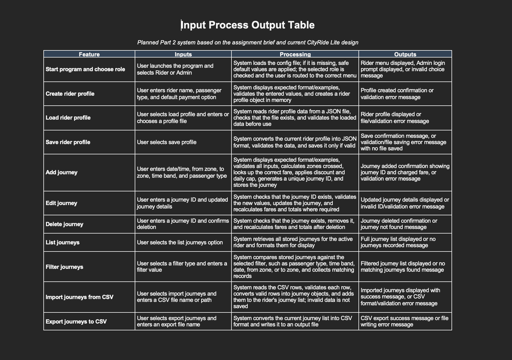

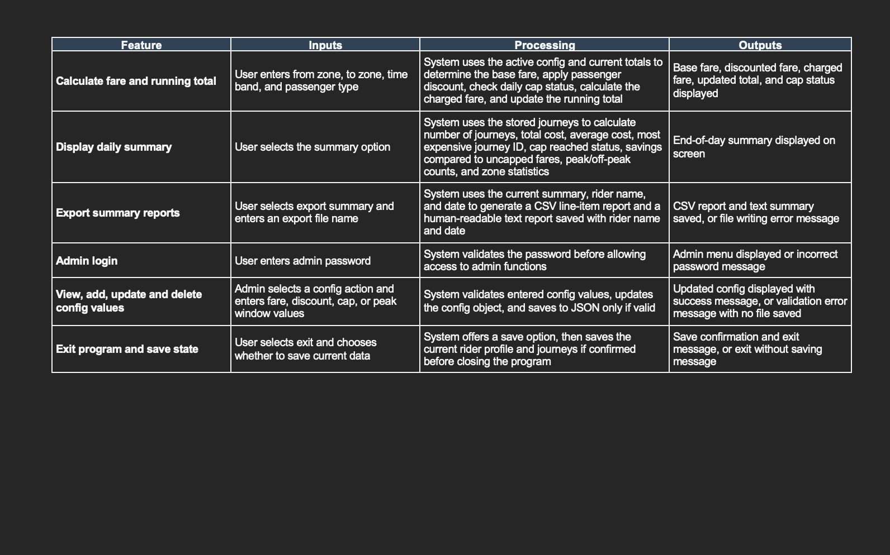

---

### Algorithm Design

---

The algorithm design is shown using two flowcharts. The first flowchart shows the overall program flow, while the second shows the add journey process in more detail. A UML class diagram is also included to show the structure of the proposed system.  

#### Main Program Flowchart

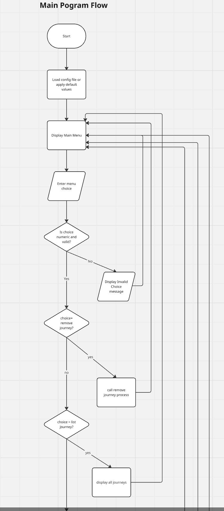  

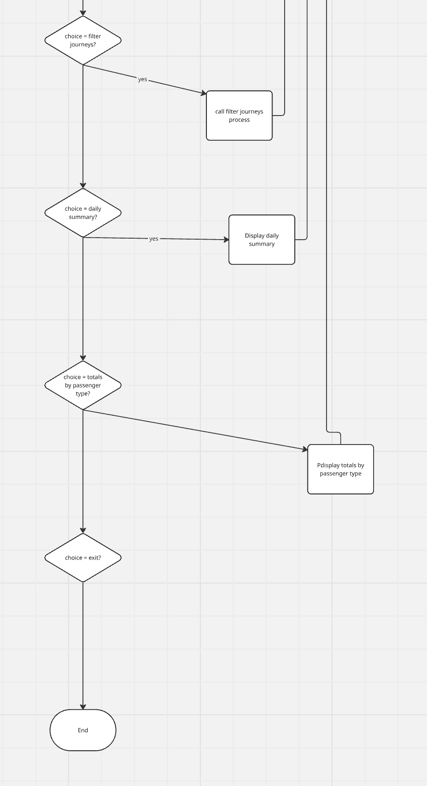  

#### Add Journey Flowchart

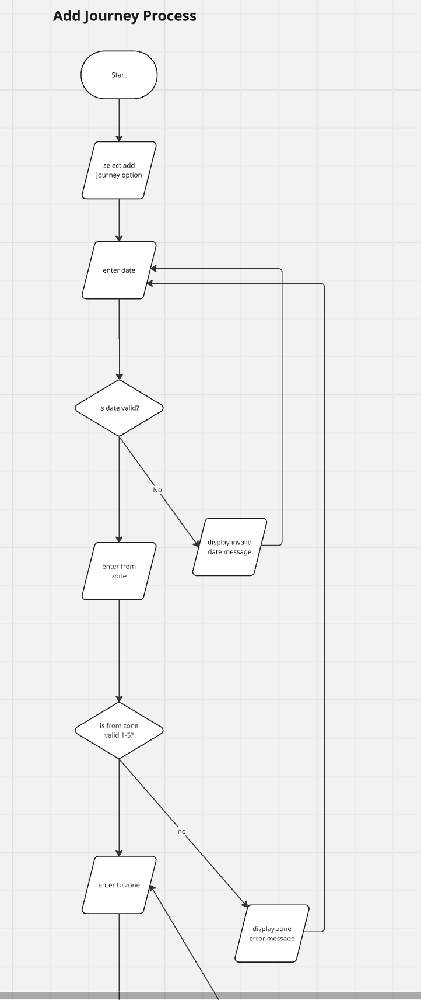  

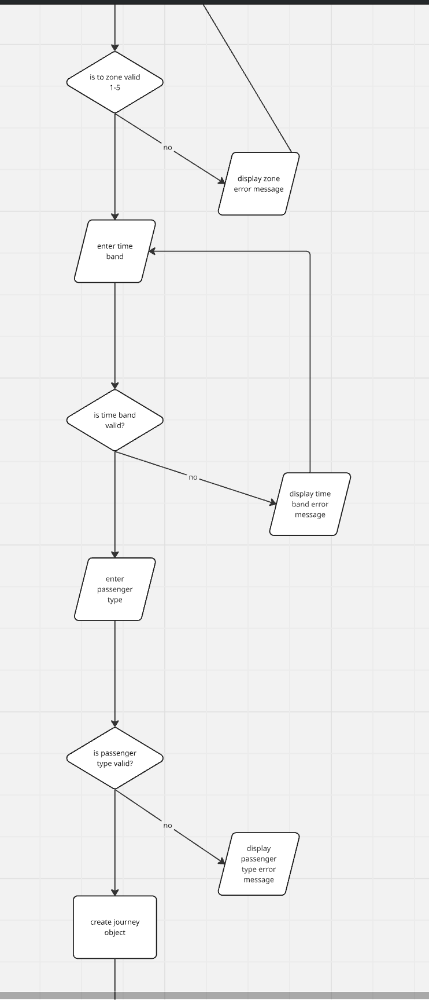  

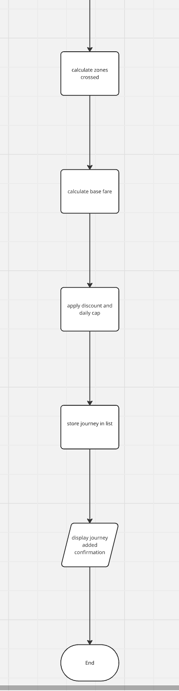  

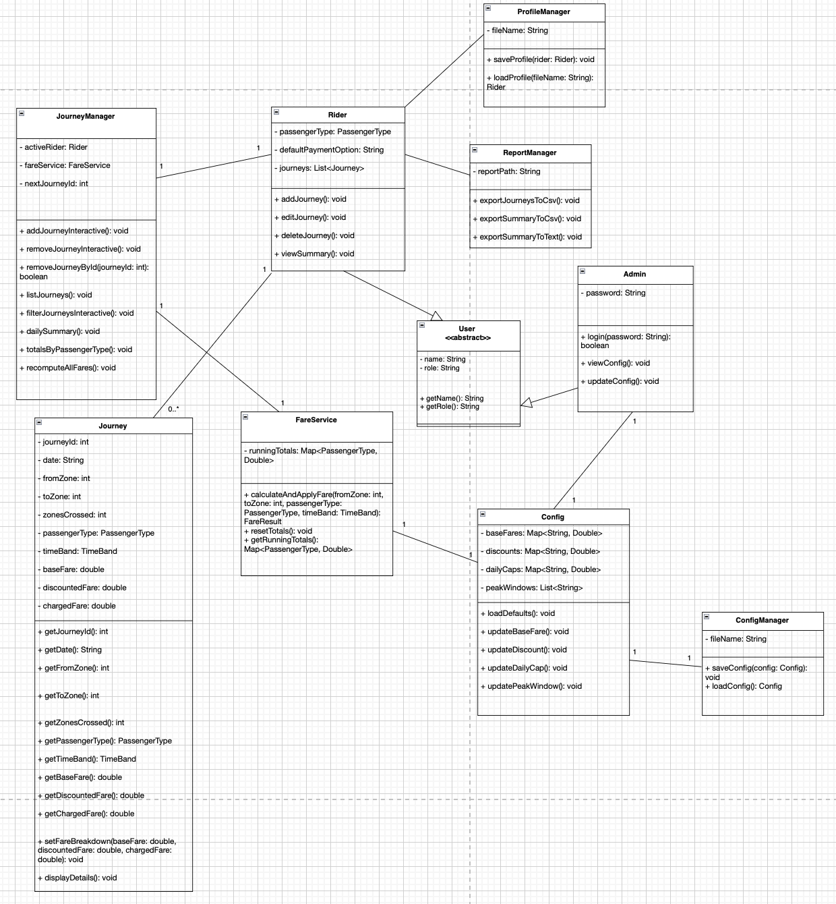

---

### Research

---

#### Research Example 1

**Name of program:** Citymapper

**Reference (link):** https://citymapper.com/

**What it does well :**

- It compares different travel options in real time across multiple transport modes.
- It provides turn-by-turn navigation, which makes journeys easier to follow.
- It presents route and travel information in a clear and user-friendly way.

**What it does poorly :**

- It focuses more on journey planning than on detailed fare rule management or administrative control.
- It includes many advanced features, which can make it feel more complex than a simple coursework system.

**Key design ideas you could reuse :**

- Clear menu-based journey selection.
- Easy-to-read output showing route and cost information.
- A practical focus on helping the user make transport decisions quickly.

**Screenshot :**  

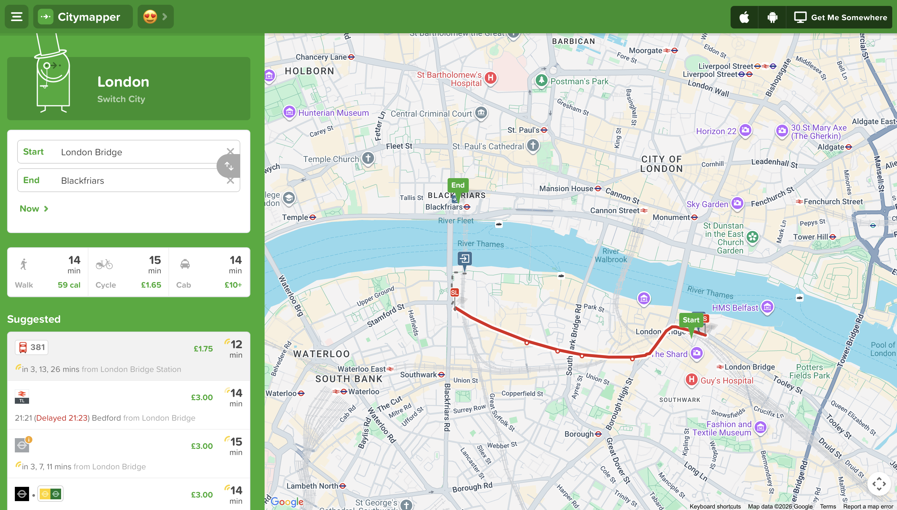

---

#### Research Example 2

**Name of program:** TfL Go

**Reference (link):** https://tfl.gov.uk/maps_/tfl-go

**What it does well :**

- It helps users plan journeys and manage their travel costs.
- It provides clear public transport information in a focused and practical way.
- It supports accessibility features such as step-free journey planning.

**What it does poorly :**

- It is mainly designed for the London transport network, so it is less flexible than a general transport fare system.
- It does not provide user-facing admin controls for changing fare rules or system configuration.

**Key design ideas you could reuse :**

- Clear separation between journey planning and travel cost information.
- Simple user interaction with direct outputs after each input.
- Practical use of summaries and travel information for everyday users.

**Screenshot :**

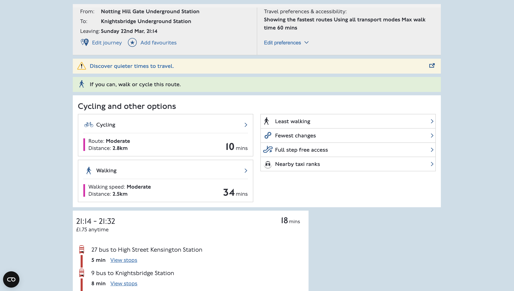

---

#### How the research informed my design

The research helped me understand how real transport-related systems present journey and fare information clearly to users. Citymapper influenced the idea of showing journey options and travel information in a simple and readable way. TfL Go was useful because it combines journey planning with travel cost support, which is closer to the aim of CityRide Lite Part 2. From these examples, I decided that my own system should have a clear menu structure, readable outputs, and practical journey summaries. I also decided to keep normal rider features separate from admin configuration features so that the program remains organised and easy to use.

---

### Gantt Chart

---

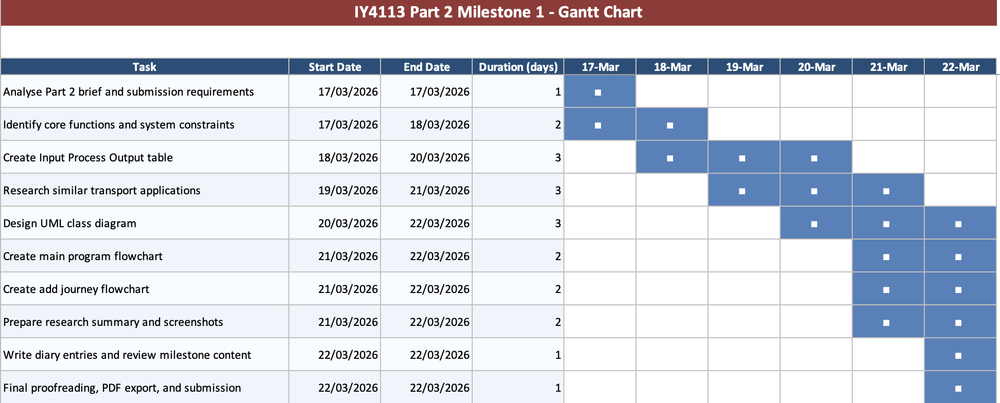  

---

### Diary Entries

---

#### Diary Entry 1 – Analysing the brief

I started by reading the Part 2 assignment brief carefully so that I could understand the new requirements and avoid repeating mistakes from Part 1. I identified that the most important changes are inheritance, file handling, rider and admin roles, and the use of JSON and CSV files. I also reviewed previous feedback to remind myself of the areas that lost marks before, especially IPO accuracy, diagram quality, and lack of detail. The main difficulty at this stage was deciding how to plan the full Part 2 system even though my current implementation is still more limited. I solved this by treating the brief as the source of truth and planning the complete system before thinking about coding.  

#### Diary Entry 2 – Planning the system

After analysing the brief, I focused on planning the structure of the proposed program. I wrote the purpose of the program, identified the core functionality, and listed the key system constraints. I then created the IPO table for the main functions of the planned Part 2 system. This time I paid much more attention to making sure each function had a real input, a clear process, and an actual output, because that was one of the weaknesses identified in my previous feedback. The main challenge was balancing my current CityRide Lite implementation with the wider Part 2 requirements. To deal with this, I presented the IPO as a planned Part 2 system built on my existing design.  

#### Diary Entry 3 – Research and design decisions

I researched existing transport-related systems to understand how similar programs present journey and fare information to users. I used Citymapper and TfL Go as examples because both show journey planning and travel information clearly, even though they are larger systems than my own coursework project. This research helped me think more carefully about menu structure, readability of outputs, and how to separate rider functions from admin functions. I used these ideas to improve my own planned design, especially in relation to journey summaries, user interaction, and keeping the system organised. The main difficulty was selecting design ideas that were realistic for a Level 1 Java console application, so I focused only on features that could be simplified and adapted to my own project.  

#### Diary Entry 4 – Creating the algorithm and class design

I then developed the design documentation for the program by creating flowcharts and a UML class diagram. I used the flowcharts to show the overall structure of the program and one of the main sub-processes in more detail. For the class diagram, I designed a structure that reflects both my current implementation and the planned Part 2 extensions, especially the use of inheritance through User, Rider, and Admin. I also included manager classes such as JourneyManager, ProfileManager, ConfigManager, and ReportManager so that the responsibilities of the system are shown more clearly. A difficulty here was making sure the diagrams stayed readable and used acceptable notation. I improved this by simplifying the relationships, using correct inheritance arrows, and avoiding unnecessary links.  

#### Diary Entry 5 – Reviewing and refining the milestone

Finally, I reviewed the milestone as a whole and checked whether each section matched the assignment brief. I refined the wording of the planning sections, improved the research explanations, and adjusted the diagrams so that they better represent the intended Part 2 system. I also made sure that my work shows stronger links between the brief, my planning decisions, and the design documentation than in Part 1. The main issue at this final stage was time management, because there were several sections to complete and refine before submission. To manage this, I prioritised the sections that are directly mentioned in the brief and focused on making each section clear, relevant, and consistent with the planned system.

---
